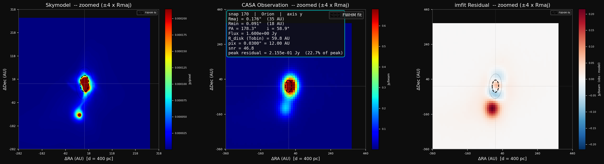
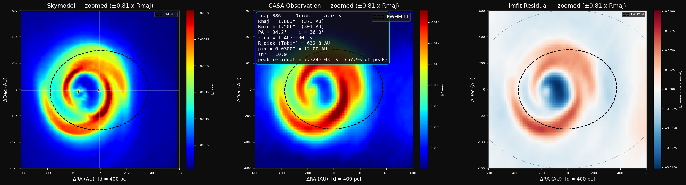

# Synthetic ALMA/VLA Disk Observation Pipeline

A pipeline for turning hydrodynamic simulation snapshots of protostellar disks
into **synthetic interferometer observations**, fitting those observations, and
recovering disk dust masses — so that "observed" disk properties can be compared
directly against the known simulation ground truth.

## Example output

Three-panel QA figures produced by `plot_three_panel.py` (Stage 4): input
skymodel, CASA synthetic observation, and imfit residual, for two Orion
snapshots at very different disk sizes/inclinations.

**Snapshot 170 — Orion — axis y**


**Snapshot 386 — Orion — axis y** (zoomed to a ±600 AU / 1200 AU × 1200 AU field of view, revealing the spiral structure)


---

The workflow has four stages:

```
 snapshots (.hdf5)
        │   skymodel_generation.py
        ▼
 sky models (.fits) + luminosities.json   ── visualization.ipynb (optional checks)
        │   casa_simulation.py   (runs inside CASA)
        ▼
 observed images (.fits)
        │   analysis.py          (runs inside CASA, reads luminosities.json)
        ▼
 fitting_results.json   (fitted sizes/fluxes + predicted dust masses)
        │   plot_three_panel.py
        ▼
 figures/   (skymodel | observation | residual QA figures, per snapshot/region/axis)
```

---

## Repository contents

| File | What it does | Where it runs |
|------|--------------|---------------|
| `skymodel_generation.py` | Reads simulation snapshots, builds dust-emissivity projections, and writes sky-model FITS images. | Plain Python (needs `yt`) |
| `visualization.ipynb` | Interactive sanity checks: inspect a snapshot, view emissivity/flux maps, compare a sky model against a CASA image. **Not required to run the pipeline.** | Jupyter |
| `casa_simulation.py` | Runs `simobserve` → `tclean` → `impbcor` → `exportfits` to produce synthetic observed images. | Inside CASA |
| `analysis.py` | Fits each observed image with `imfit` and converts the fitted flux into a dust mass. Combines the old `imfit_new.py` and `dust_prediction_code.py` into one pass over a folder. | Inside CASA |
| `plot_three_panel.py` | Renders zoomed skymodel / observation / residual QA figures for each fitted disk in `fitting_results.json`. Supports `--variant {thin,skirt}`. | Plain Python |
| `plot_three_panel.ipynb` | Interactive version of the same three-panel plot, plus scratch analysis cells. **Not required to run the pipeline.** | Jupyter |
| `casa_simulation_skirt.py` | SKIRT-variant counterpart to `casa_simulation.py` -- same `simobserve`/`tclean`/`impbcor`/`exportfits` pipeline, byte-identical observing parameters, run on SKIRT sky models instead. | Inside CASA |
| `analysis_skirt.py` | SKIRT-variant counterpart to `analysis.py`. Writes to `fitting_results_skirt.json` instead of `fitting_results.json`. | Inside CASA |
| `plot_thin_vs_skirt.py` | Two-row QA figure comparing the thin and SKIRT pipelines for one snapshot/region/axis at a shared physical zoom. | Plain Python |

---

## Stage 1 — Generate sky models

```bash
python skymodel_generation.py --input-dir /path/to/snapshots --output-dir skymodels
```

For each snapshot this writes one FITS file per (region, projection axis), e.g.
`snapshot_170_Orion_flux_map_ALMA_axis_x.fits`. The output filename pattern is
relied on by the later stages, so don't rename the files.

It also writes `luminosities.json`, a small file mapping each snapshot ID to its
total protostellar luminosity (summed `StarLuminosity_Solar` over the sink
particles). Stage 3 reads this to set the dust temperature used in the dust-mass
estimate. Change its location with `--luminosity-file`.

Common options:

```bash
# Process a whole directory
python skymodel_generation.py -i ./data -o skymodels

# Process specific snapshots instead of a whole directory
python skymodel_generation.py --snapshots snap_170.hdf5 snap_171.hdf5 -o skymodels

# only snapshots 170-179
python skymodel_generation.py -i ./data --glob "snapshot_17*.hdf5" -o skymodels

# Use the VLA preset (different opacity/frequency)
python skymodel_generation.py -i ./data -o ./skymodels --telescope VLA
```

The physics and geometry (dust opacity `kappa_nu`, frequency `nu`,
dust-to-gas ratio, projection resolution, region distances) live in the
`Config` dataclass and `TELESCOPE_PRESETS` dictionary at the top of the script.
Run `python skymodel_generation.py --help` for all options.

### Optional: sanity-check a snapshot first

Open `visualization.ipynb`, set `SNAPSHOT_PATH`, and run the cells to look at
the disk mass, the dust-emissivity projection, and the per-region flux maps
before committing to a batch run.

---

## Stage 2 — Synthetic observation (CASA)

Run on a folder of sky models:

```bash
casa --nogui --nologger -c casa_simulation.py \
    --skymodel-dir skymodels --out-dir pbcor_imgs
```

or, from inside an interactive CASA session:

```python
import sys
sys.argv = ['casa_simulation.py', '--skymodel-dir', 'skymodels',
            '--out-dir', 'pbcor_imgs']
execfile('casa_simulation.py')
main()
```

This produces a primary-beam-corrected image
`ALMA_snapshot_<id>_axis_<axis>_<Region>_sim_observed_pbcor.fits` for each sky
model in `pbcor_imgs/`. Pass `--skip-existing` to resume an interrupted run.

The observing setup (pointing, frequency, integration time, array
configuration, noise model, imaging parameters) is collected in the
`OBS_SETTINGS` dictionary near the top of the script.

---

## Stage 3 — Fit & predict dust masses (CASA)

```bash
casa --nogui --nologger -c analysis.py \
    --image-dir pbcor_imgs --results fitting_results.json \
    --luminosity-file luminosities.json
```
or, from inside an interactive CASA session:

```python
import sys
sys.argv = ['analysis.py', '--image-dir', 'pbcor_imgs',
            '--results', 'fitting_results.json',
            '--luminosity-file', 'luminosities.json']
execfile('analysis.py')
main()  
```

For each observed image this:

1. fits a 2-D Gaussian with `imfit` (size, flux, inclination, position angle,
   fit-quality metrics);
2. exports the residual and model images to `residual_imgs/` and `model_imgs/`;
3. converts the fitted flux into a dust mass assuming optically thin,
   isothermal dust.

Results are written to `fitting_results.json` with the structure:

```
{ snapshot: { region: { axis: { Rmaj, flux, inc, radius_AU_Tobin,
                                snr, dust_mass_Msun, ... } } } }
```

**Dust temperature.** The dust mass depends on an assumed dust temperature.
Stage 3 reads `luminosities.json` (written by stage 1) and scales the
temperature as `T = 43 K · L^0.25` per snapshot. If the luminosity file is
missing, or a snapshot's luminosity is zero (no protostar has formed yet), it
falls back to `--dust-temp` (default 43 K). 

---

## Stage 4 — Three-panel QA figures

```bash
python plot_three_panel.py \
    --results fitting_results.json --skymodel-dir skymodels \
    --pbcor-dir pbcor_imgs --residual-dir residual_imgs --out-dir figures
```

For every snapshot/region/axis present in `fitting_results.json` this writes
a `snap<snapshot>_<Region>_axis<axis>_three_panel.png` to `--out-dir`, each
showing the skymodel, the CASA observation, and the imfit residual side by
side with the fitted Gaussian ellipse overlaid and the fit statistics
annotated. Restrict the run with `--snapshots`, `--fields`, and `--axes`,
e.g. `--snapshots 170 386 --fields Orion --axes y` to reproduce the figures
shown at the top of this README.

The core `plot_three_panel(pbcor_fpath, fit, skymodel_dir, residual_dir, ...)`
function takes a `savefig` argument — an explicit output path that overrides
the `out_dir`/auto-generated naming — so it can also be called directly
(e.g. from `plot_three_panel.ipynb` or another script) to save a single
figure wherever you like.

`plotting_utils.py` also exposes `plot_three_panel_stack(snapshots, field,
axis, results, pbcor_dir, skymodel_dir, residual_dir, ...)`, which renders
the same three panels but as one row per snapshot in a single figure — handy
for eyeballing a run of consecutive snapshots side by side. It optionally
annotates each row with a fitted-vs-true dust mass comparison when given a
`mass_dict` (per-snapshot true masses) and/or a `df` (a table with fitted
masses); see its use in `plot_three_panel.ipynb`.

---

## SKIRT variant

Stage 1 has a second, independent path: **SKIRT** Monte Carlo radiative-transfer
sky models, produced *outside* this repo and dropped into `skymodels/` already
in the same FITS convention as the thin sky models (`BUNIT=Jy/pixel`,
`CTYPE=LINEAR`, `CDELT` in deg, `PARC` in arcsec/pix). `skymodel_generation.py`
itself is untouched -- SKIRT sky models are simply additional files placed
alongside the thin ones.

Stages 2-4 support both variants side by side so the two can be compared
directly for the same snapshot:

| Stage | Thin (default) | SKIRT |
|-------|-----------------|-------|
| 2 — CASA simulation | `casa_simulation.py` | `casa_simulation_skirt.py` |
| 3 — Fit & dust mass | `analysis.py` | `analysis_skirt.py` |
| 4 — QA figures | `plot_three_panel.py` (`--variant thin`, the default) | `plot_three_panel.py --variant skirt` |

Each SKIRT driver is a **separate file**, not a flag on the thin one, so the
existing thin pipeline is guaranteed untouched: every thin command, filename,
and `fitting_results.json` entry keeps working exactly as before whether or
not any SKIRT files exist.

**Naming convention.** The SKIRT variant of a file is the thin filename with
`_SKIRT` appended to the stem, immediately before the extension (or before a
trailing `_residual`/`_model`), and lives in the *same* folder as the thin
file:

```
skymodels/snapshot_170_Orion_flux_map_ALMA_axis_z.fits            (thin)
skymodels/snapshot_170_Orion_flux_map_ALMA_axis_z_SKIRT.fits      (SKIRT)

pbcor_imgs/ALMA_snapshot_170_axis_z_Orion_sim_observed_pbcor.fits
pbcor_imgs/ALMA_snapshot_170_axis_z_Orion_sim_observed_pbcor_SKIRT.fits

residual_imgs/ALMA_snapshot_170_axis_z_Orion_sim_observed_pbcor_SKIRT_residual.fits
model_imgs/ALMA_snapshot_170_axis_z_Orion_sim_observed_pbcor_SKIRT_model.fits
```

Because the `_SKIRT` suffix comes at the very end, it doesn't disturb the
positional filename parsing (`split("_")`) used for the pbcor/residual/model
files elsewhere in the pipeline. The one place it *would* (the sky-model
filename, where the axis letter is the last token before the extension) is
handled with an explicit regex parser in `casa_simulation_skirt.py`
(`parse_skirt_skymodel_filename`) instead of a positional split.

**Separate results file.** `analysis_skirt.py` writes to
`fitting_results_skirt.json` by default -- never `fitting_results.json` --
keyed with the same `{ snapshot: { region: { axis: {...} } } }` schema as the
thin results. This is what makes the thin plotting driver (and any other
existing consumer of `fitting_results.json`) require zero changes: SKIRT fits
can never collide with or overwrite a thin entry for the same
snapshot/region/axis.

Because SKIRT pbcor/skymodel files can live in the same folders as the thin
ones, both `casa_simulation_skirt.py` and `analysis_skirt.py` default their
`--glob` to `*_SKIRT.fits` so a SKIRT run only ever touches SKIRT files. If
you re-run the *thin* `analysis.py` after SKIRT pbcor images already exist in
`pbcor_imgs/`, its default `--glob "*.fits"` would pick those up too -- pass
an explicit thin-only glob, e.g. `--glob "*_sim_observed_pbcor.fits"`
(SKIRT files end in `_pbcor_SKIRT.fits` and don't match), to avoid that.

**Comparing the two.** `plot_thin_vs_skirt.py` renders a two-row figure (thin
on top, SKIRT on the bottom) for one snapshot/region/axis:

```bash
python plot_thin_vs_skirt.py --snapshot 170 --field Orion --axis z \
    --thin-results fitting_results.json \
    --skirt-results fitting_results_skirt.json \
    --out-dir figures
```

imfit measures very different disk sizes on the two variants of the same
disk (e.g. Rmaj = 0.151" / 30 AU on the thin image of snapshot 170 vs. 1.197"
/ 239 AU on its SKIRT image), so the default Rmaj-relative zoom used
elsewhere in this repo would put the two rows at different physical scales.
`plot_thin_vs_skirt.py` instead defaults to `--fixed-au 300`: both rows are
cropped to the same physical half-width (in AU, not pixels), and the top
row's skymodel/observation colour scale is reused for the bottom row, so the
six panels are genuinely comparable. `plot_three_panel.py` also accepts
`--fixed-au` directly if you want a single-variant figure at a fixed
physical scale instead of the default Rmaj-relative zoom.

---

## Output files

| File / folder | Produced by | Contents |
|---------------|-------------|----------|
| `skymodels/` | Stage 1 | Sky-model FITS images (thin and, if present, `*_SKIRT` variants) |
| `luminosities.json` | Stage 1 | Per-snapshot total protostellar luminosity (Lsun); shared by both variants |
| `pbcor_imgs/` | Stage 2 / Stage 2 (SKIRT) | Synthetic pb-corrected observations (thin and `*_SKIRT`) |
| `residual_imgs/`, `model_imgs/` | Stage 3 / Stage 3 (SKIRT) | imfit residual & model images (thin and `*_SKIRT`) |
| `fitting_results.json` | Stage 3 (`analysis.py`) | Thin fitted properties + predicted dust masses |
| `fitting_results_skirt.json` | Stage 3 (`analysis_skirt.py`) | SKIRT fitted properties + predicted dust masses, same schema, kept separate |
| `figures/` | Stage 4 | Three-panel QA PNGs (thin, SKIRT, and thin-vs-SKIRT comparison) |

---

## Notes 

- Snapshot **unit conventions are read from each file's header**, so the sky-model
  stage adapts to different runs without code changes.
- The four stages communicate purely through **files and filename conventions**.
  If you change a filename pattern in one stage, update the parsing in the next.
- The scripts check-point as they go (writing JSON / FITS after each item), so a
  long run can be interrupted and resumed.
- See the "SKIRT variant" section above for the `_SKIRT` naming convention and
  the separate `fitting_results_skirt.json`.

